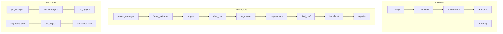

# VoCRA — Video OCR Subtitle Extractor

## Finalized Decisions

| Decision | Answer |
|---|---|
| Stack | Python 3.11 + PySide6 |
| Draft OCR | PaddleOCR v5 (local) |
| Final OCR priority | llama.cpp local → Chrome Lens → API |
| Translator priority | API → Local (llama.cpp) |
| Translator | Optional, separate Scene 5 |
| Frame interval | User-configurable, no hardcoded default |
| Language OCR | `auto` |
| Language translate | `auto → vi` default |
| Translation batch | 300 segments/batch default |
| Export bilingual | No. Separate files per language |
| Video preview | QMediaPlayer (smooth) + OpenCV (crop frame) |
| Crop | Must pause video first |
| Config | Per-project. App-level template in app folder |
| Multi-project | No. New video OR open existing project |
| llama.cpp | `tools/` dir, user copies binary in |
| Progress file | `progress.json` |
| Video types | mp4, mkv, white text common |

---

## Architecture



## Project Structure

```text
c:\Nghich\vocra\
├── main.py
├── tools/                           # llama.cpp binary (user copies in)
├── vocra_core/
│   ├── project_manager.py           # progress.json CRUD
│   ├── frame_extractor.py           # ffmpeg → timestamp.json
│   ├── cropper.py                   # OpenCV crop → cache/cropped/
│   ├── draft_ocr.py                 # PaddleOCR v5 → ocr_og.json
│   ├── draft_ocr_providers.py       # Pluggable draft OCR
│   ├── segmenter.py                 # difflib grouping → segments.json
│   ├── preprocessor.py              # Enhance images → cache/preprocessed/
│   ├── text_cleaner.py              # Clean OCR/translation output
│   ├── exporter.py                  # SRT/ASS/TXT export
│   ├── final_ocr/
│   │   ├── base.py                  # FinalOCRProvider protocol
│   │   ├── provider_factory.py
│   │   ├── openai_compatible.py     # Reuse deepseek_ocr_client pattern
│   │   ├── llama_server_manager.py  # Reuse mmt_core/llama_server pattern
│   │   └── chrome_lens.py
│   └── translator/
│       ├── base.py                  # BaseTranslator (from manga-translator)
│       ├── provider_factory.py
│       ├── openai_compatible.py     # API translator (reuse pattern)
│       └── llama_local.py           # Local llama.cpp translator
├── vocra_gui/
│   ├── main_window.py               # QMainWindow + 5-scene nav
│   ├── scene_setup.py               # Scene 1
│   ├── scene_process.py             # Scene 2
│   ├── scene_translator.py          # Scene 3 (optional)
│   ├── scene_export.py              # Scene 4
│   ├── scene_config.py              # Scene 5
│   ├── widgets/
│   │   ├── video_preview.py         # QMediaPlayer wrapper
│   │   ├── crop_overlay.py          # Draggable rectangle
│   │   ├── log_panel.py
│   │   ├── subtitle_table.py
│   │   └── progress_bar.py
│   └── styles/
│       └── theme.qss                # Dark theme
└── servers/                         # Auto-generated bat files
```

---

## Cache Files

| File | Content | Responsibility |
|---|---|---|
| `progress.json` | Project config + step status | Bản đồ tổng thể |
| `timestamp.json` | image ↔ timestamp mapping | Timeline source |
| `ocr_og.json` | Draft OCR text per frame | So sánh/gom nhóm |
| `segments.json` | Grouped subtitles (start/end/represent) | Cầu nối OCR ↔ timeline |
| `ocr_fn.json` | Final OCR text per segment | Subtitle text source |
| `translation.json` | Translated text per segment | Translation cache |

---

## Phase Breakdown

### Phase 1: Scaffold + Cache (30 min)
- `main.py` entry point
- `project_manager.py`: create/load/update `progress.json`
- Directory structure creation

### Phase 2: Video Pipeline (1.5 hr)
- `frame_extractor.py`: ffmpeg subprocess → frames + `timestamp.json`
- `cropper.py`: OpenCV crop → `cache/cropped/`
- `draft_ocr.py` + `draft_ocr_providers.py`: PaddleOCR v5 → `ocr_og.json`

### Phase 3: Segment + Preprocess (1 hr)
- `segmenter.py`: difflib SequenceMatcher grouping → `segments.json`
- `preprocessor.py`: grayscale + CLAHE + upscale 2x → `cache/preprocessed/`

### Phase 4: Final OCR + Translator Backends (2 hr)
- `final_ocr/`: base protocol, OpenAI-compatible client, llama server manager, chrome lens
- `translator/`: base class, OpenAI-compatible translator, llama local translator
- `text_cleaner.py`, `exporter.py` (SRT/ASS/TXT)

### Phase 5: PySide6 GUI (2.5 hr)
- **Scene 1 Setup**: QMediaPlayer preview, pause → crop overlay, frame interval config
- **Scene 2 Process**: Step indicator, Prepare/Draft OCR/Final OCR buttons, log panel, QThread workers
- **Scene 3 Translator**: Optional, translate button, batch progress, source/target lang selector
- **Scene 4 Export**: Editable subtitle table, export buttons (SRT/ASS/TXT), choose original or translated
- **Scene 5 Config**: Final OCR provider config, llama.cpp server manager, translator API config, draft OCR settings

### Total: ~7-8 hours

---

## Key Patterns Reused from Manga-Translator

| Component | Source Reference |
|---|---|
| OCR Provider Protocol | [ocr_providers.py](file:///c:/Nghich/Manga-Translator/mmt_core/ocr_providers.py) |
| OpenAI-compatible client | [deepseek_ocr_client.py](file:///c:/Nghich/Manga-Translator/mmt_core/deepseek_ocr_client.py) |
| Llama server manager | [llama_server.py](file:///c:/Nghich/Manga-Translator/mmt_core/llama_server.py) |
| Text cleaner | `deepseek_ocr_client._clean_output()` |
| Translator base | [base.py](file:///c:/Nghich/Manga-Translator/translator/base.py) |
| OpenAI translator | [openai_compatible_translator.py](file:///c:/Nghich/Manga-Translator/translator/openai_compatible_translator.py) |

## Verification Plan

1. `python main.py` → GUI launches
2. Load video → extract frames → verify `timestamp.json`
3. Crop + Draft OCR → verify `ocr_og.json` + `segments.json`
4. Final OCR (with llama.cpp server) → verify `ocr_fn.json`
5. Export → verify SRT format
6. Resume test: kill mid-process → restart → continues from saved state
